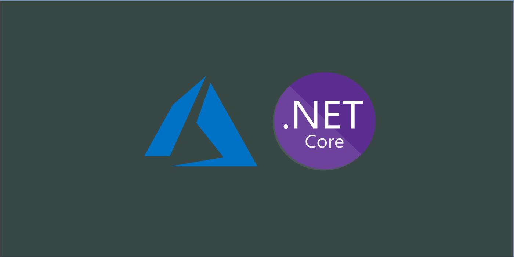

<h1 align="center">Contador</h1>

<p align="center">
  

  
</p>



## 🌱 Projeto

- ASP.NET Core 5 + REST API Contagem de Acessos

## 🛠️ Objetivo

- Para os testes envolvendo o uso do Kubernetes a partir do Microsoft Azure, será criada uma API REST baseada no ASP.NET Core 5.0. Esta aplicação produzirá como retorno a quantidade de acessos à API, Kernel do sistema operacional utilizado pelo container Docker, TargetFramework, uma mensagem fixa e outra variável. 

## ✨ Tecnologias

- ASPNETCore 5
- Docker
- Azure
- Azure Pipelines
- Kubernetes

## 🚀 Exemplo de execução da API

- http://localhost:64762/contador

```
{
  "valorAtual": 1,
  "local": "app-demo-aspnetcore5-7f9997b867-ks4xp",
  "kernel": "Unix 5.4.0.1059",
  "targetFramework": ".NETCoreApp,Version=v5.0",
  "mensagemFixa": "Teste",
  "mensagemVariavel": "Teste utilizando o arquivo appsettings.json"
}
```